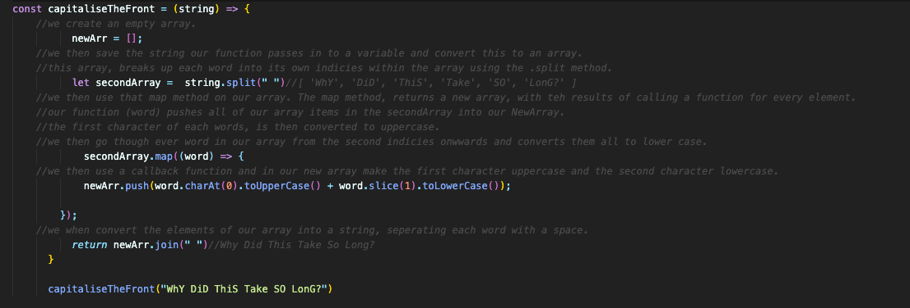

### Capitalise the Front

Create a function that will take a string as an argument. In this function, use your favourite loop to capitalise the first letter of each word, whilst making each other letter lowercase.

E.g. capitaliseTheFront("sinGLE"), should return "Single"

E.g. capitaliseTheFront("TWO words"), should return "Two Words"

E.g. capitaliseTheFront("Quite a Long SENTENCE!"), should return "Quite A Long Sentence!"

