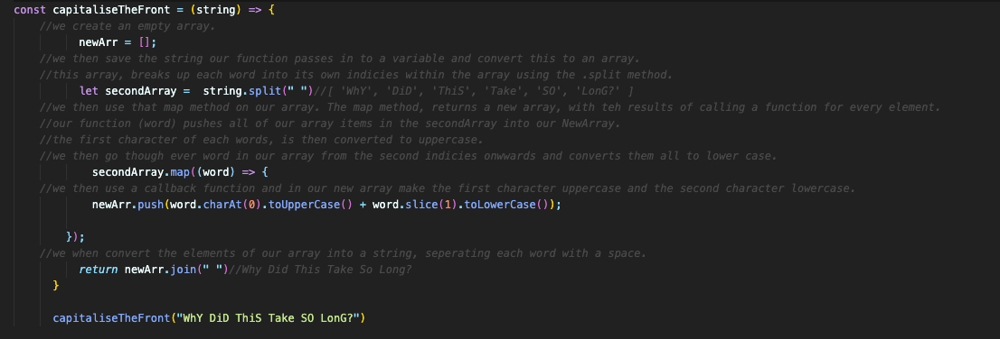

### Capitalise the Front

Create a function that will take a string as an argument. In this function, use your favourite loop to capitalise the first letter of each word, whilst making each other letter lowercase.

E.g. capitaliseTheFront("sinGLE"), should return "Single"

E.g. capitaliseTheFront("TWO words"), should return "Two Words"

E.g. capitaliseTheFront("Quite a Long SENTENCE!"), should return "Quite A Long Sentence!"

## Atomic Blonde

A number is an atomic blonde number if the sum and product of its digits are equal. Write a program to check if a number is an atomic blonde number or not. 

E.g. atomicBlonde(123), should return true (as 1 + 2 + 3 equals 6, as does 1 * 2 * 3)

E.g. atomicBlonde(23), should return false (as 2 + 3 equals 5, whereas  2 * 3 equals 6)

## Arguments

Create a function that will take any number of arguments. Multiply all these arguments together, and return the result. If no arguments are entered, return 0.

E.g. multipleArguments(1, 2, 3, 4, 5, 6, 7), should return 5040

## Multiply Value

Create a function which will take a string or number value and multiply it a specific number of times. The first parameter is the value to be multiplied.
The second parameter is the number of times the value should be multiplied.If the first parameter is not a number or string, the function should return null.If the second parameter is not a valid number the code should return null.

E.g. multiplyValue(9,2), should return 18 (as 9*2 = 18)

E.g. multiplyValue("[alright]",3), should return "[alright][alright][alright]"

E.g. multiplyValue(5,["kanye west"]) == null

## Brad, the bartender

Brad is a bartender at a fancy cocktail bar; he's a fantastic mixologist but not the best mathematician. Let's help him out and create a function that lets him know how many cocktails he can make with the ingredients on hand.

Write a function maximumCocktails(), which takes the recipe (object) and the available ingredients (also an object) and returns the maximum number of cocktails Brad can bake (integer). For simplicity there are no units for the amounts (e.g. 100ml of vodka or 20 olives  are simply 100 or 20). 

### e.g 

maximumCocktails(martiniRecipe, barStock) //=> 3

maximumCocktails should return three as that's the most cocktails we can make before running out of gin 

let negroniRecipe = {gin:25, vermouth: 25, campari: 25}
let barStock = {gin: 2250, vermouth: 2250, olives: 60}
maximumCocktails(negroniRecipe, barStock) //=> 0

maximumCocktails should return zero as there's no campari to make a negroni with

let oldFashionedReicpe = {whisky: 60, sugarCube: 1, bitters: 5}
let barStock = {sugarCube: 2, bitters: 20, whisky: 1000 }
maximumCocktails(oldFashionedReicpe, barStock) // = 2 

maximumCocktails should return 2 as that's the most old fashioneds we can make before running out of sugar cubes

## Abbreviate a Two Word Name

Write a function to convert a name into initials. This kata strictly takes two words with one space in between them.

The output should be two capital letters with a dot separating them.

It should look like this:

Sam Harris => S.H

Patrick Feeney => P.F

